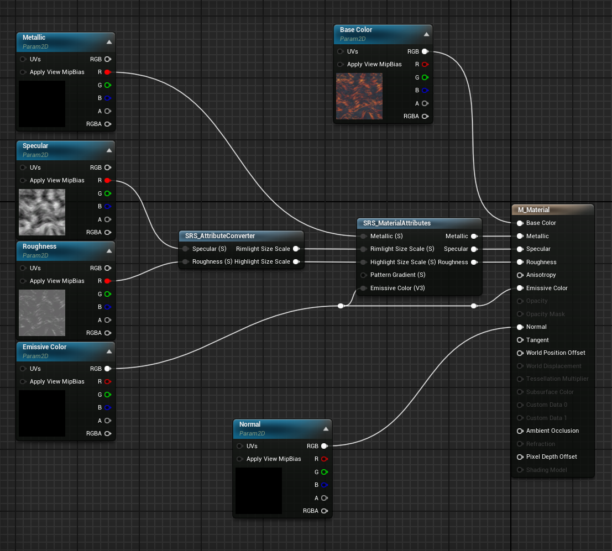

# Getting Started
In the following, you are going to learn how to install SRS and setup your project so it works with SRS.

{: .no_toc }

  

    Table of contents
  

  {: .text-delta }
1. TOC
{:toc}

---

##  Install and Setup

1. Open up the Epic Games Launcher, click on Unreal Engine and head to your Library.
2. Find 'Stylized Rendering System' in your Vault and click add to project.
3. Select the project you want to add SRS to.
4. Open up your project and open your project settings
5. Under the Engine category in the Rendering Tab, set "Custom Depth-Stencil Pass" to "Enabled with Stencil".

---

## Adding SRS to your scene

1. Navigate to StylizedRenderingSystem/Blueprints your content browser.
2. Drag the actor "BP_StylizedRenderingSystem" into your scene. This actor will allow you to control where SRS will take affect and how SRS will render your scene. 
3. Select the actors you want SRS to affect and enable "Render CustomDepth Pass" in the details panel
4. If you want SRS to affect your entire scene, disable "Only On Custom Depth" in the details panel of the SRS actor you just dragged into your scene. 

If at this point you are facing issues with the size of the shadows on cel-shaded objects or smoothly lit areas on sides of meshes facing the sun, this may be caused by the following reasons:
- The Directional Light (Sun Light or Light Source) is too bright or too dim. Using an Intensity of 2,0 lux may resolve the issue.
- The Sky Light is too bright or too dim. Using an Intensity Scale of 1,0 and a Light Color of white (#FFFFFFFF) may resolve the issue.

Alternatively you can increase or decreate the shadow size parameters "S Shadow Size" and "MS Shadow Size" in the SRS actor until the shadow has an appropriate size.

---

## Converting existing materials to work with SRS

If you have previously created materials that you want to use in combination with SRS, you will have to slightly modify the material as instructed below:

1. Open the material editor for a material you want to make compatible with SRS
2. Add the SRS_MaterialAttributes node and connect the outputs to the inputs with the same name on the **Material Outputs** node.
3. Add the SRS_AttributeConverter node and connect the outputs to the inputs with the same name on the **SRS_MaterialAttributes** node.
4. If there were previous connections to the input pins of the **Material Outputs** node, connect those with the respective inputs on the two nodes that were just created.
5. If there is an Emissive Color Texture, connect that to the **SRS_MaterialAttributes** node as well.
6. The final result should look similar to this:

---
