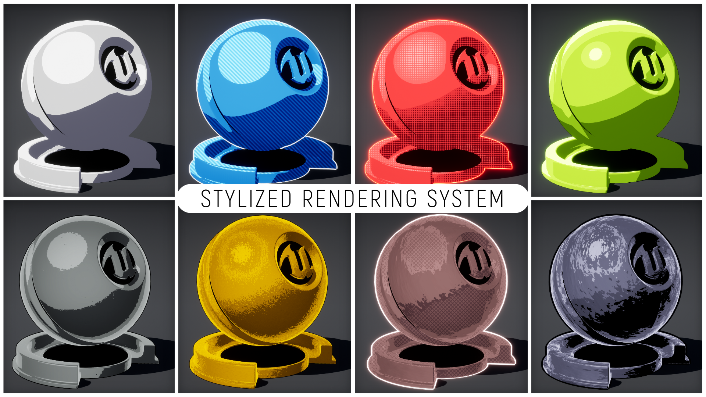

# Easily cel-shade your environments and characters in UE4
{: .fs-9 }

Stylized Rendering System allows you to easily create the perfect art style for your UE4 projects.
{: .fs-6 .fw-300 }

[Get started now](getting_started){: .btn .btn-primary .fs-5 .mb-4 .mb-md-0 .mr-2 }

Don't have SRS?
{: .fs-4 .fw-300 }
[Buy now on the UE4 Marketplace](https://unrealengine.com/marketplace/en-US/store){: .btn .fs-4 .mb-3 .mb-md-0 }

---
# Stylized Rendering System

