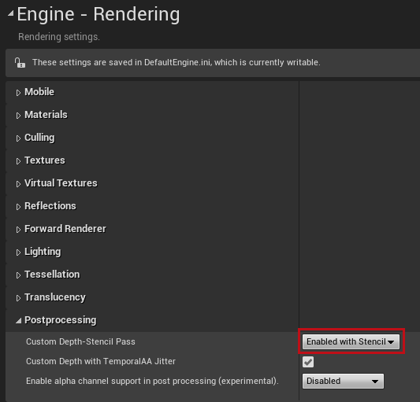
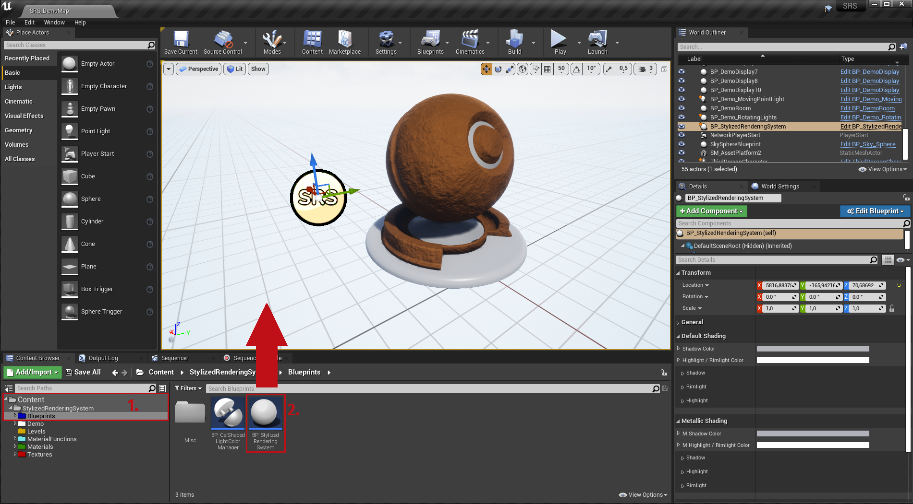

# Stylized Rendering System Documentation

# Quick Start

### 1 - Setting your project up to work with SRS

1. Open up the Epic Games Launcher, click on Unreal Engine and head to your Library.
2. Find 'Stylized Rendering System' in your Vault and click add to project.
3. Select the project you want to add SRS to.
4. Open up your project and open your project settings
5. Under the Engine category in the Rendering Tab, set "Custom Depth-Stencil Pass" to "Enabled with Stencil".

### 2 - Adding SRS to your scene

1. Navigate to StylizedRenderingSystem/Blueprints your content browser.
2. Drag the actor "BP_StylizedRenderingSystem" into your scene. This actor will allow you to control where SRS will take affect and how SRS will render your scene. 
3. Select the actors you want SRS to affect and enable "Render CustomDepth Pass" in the details panel
4. If you want SRS to affect your entire scene, disable "Only On Custom Depth" in the details panel of the SRS actor you just dragged into your scene. 

### 3 - Setting up your Materials to work with SRS

# Materials and SRS

### SRS_MaterialAttributes

### SRS_AttributeConverter

## BP_StylizedRenderingSystem

